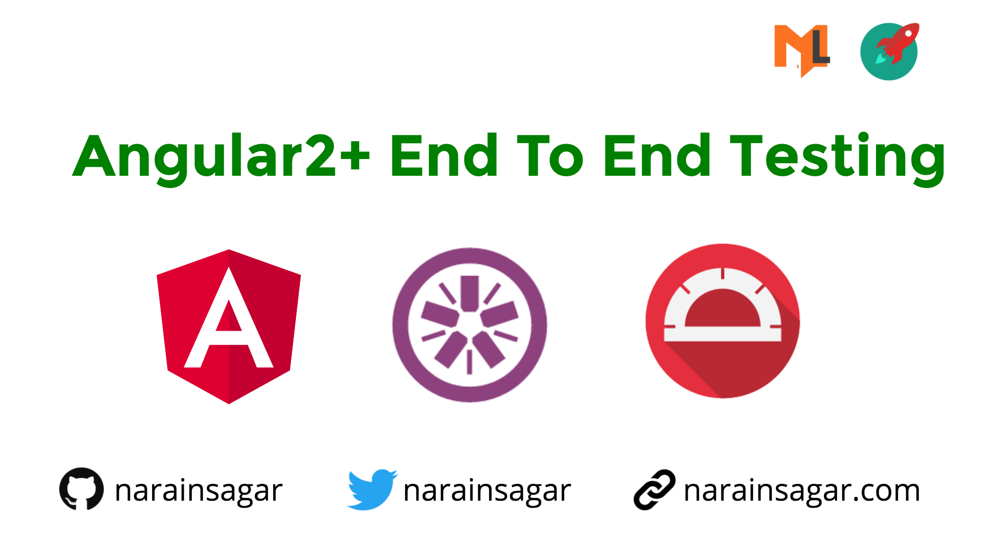

# Getting Started with Angular2+ End To End (e2e) Testing

A small & introductory talk on e2e - Angular2 End to End Testing - basics, types, tools, techs, etc.

**Questions discussed in detail are: What, Why, How, etc?**

## Slides

Slides can be accessed by following link: 
[slides.com/narainsagar/angular2-e2e-testing](http://slides.com/narainsagar/angular2-e2e-testing)

## Summary

Following points we have covered in this session:

* Introduction
* Types of testing
* What is Automation testing?
* Unit vs E2E testing ?
* E2E: Tools & Technologies
* Basic code samples
* Code samples

## About Me

> My name is **Narain Sagar**, I’m a FullStack JavaScript Developer, lives in  Karachi, Pakistan and pretty much enjoying my life.

### Follow Me 👍

[Medium](http://blog.narainsagar.com/) | 
[Website](http://narainsagar.com/) | 
[Twitter](https://twitter.com/narainsagar) | 
[LinkedIn](https://www.linkedin.com/pk/narainsagar) | 
[Facebook](https://facebook.com/NarainSagarPage) | 
[Github](https://github.com/narainsagar) | 
[Stack Overflow](www.stackoverflow.com/users/5228251/narainsagar)