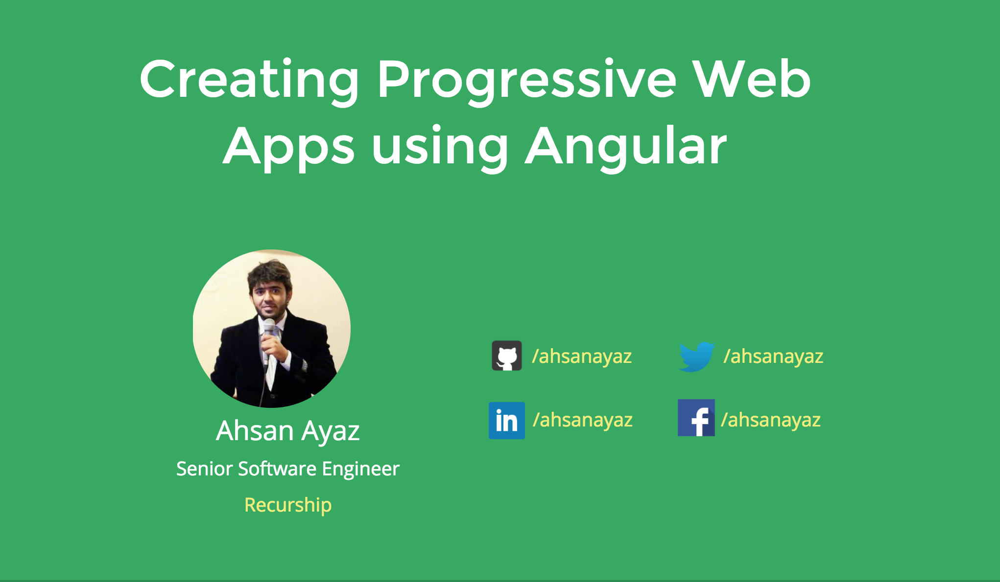

# Creating Progressive Web Apps Using Angular

A brief talk about how to create a progressive web app using the modern technologies/tools we have with Angular. You can also convert an existing Angular app to PWA.

## Slides

Slides are available on the link below.
[https://slides.com/ahsanayaz/creating-pwas-using-angular/](https://slides.com/ahsanayaz/creating-pwas-using-angular/)

## LIVE DEMO

Live demo of the progressive web app created during the talk
[https://ahsanayaz.github.io/ng-books-pwa](https://ahsanayaz.github.io/ng-books-pwa)

## Code Respository

The complete code of a functional progressive web app created during the talk is uploaded here.
[https://github.com/AhsanAyaz/ng-books-pwa](https://github.com/AhsanAyaz/ng-books-pwa)

## Summary

We discussed the below points in the talk:

* Evolution of web apps/ web pages
* What are progressive web apps
* What characteristics should PWAs have.
* Creating a simple PWA
* Making the PWA `Reliable`.
* Making the PWA `Faster`.
* Making the PWA `Engaging`.

## About Me

> I'm [**Ahsan Ayaz**](https://github.com/ahsanayaz). A passionate developer with <3 for JS. I've been working with JS & Angular and have been developing web apps and hybrid mobile apps for 4 years+. Currently working as a Senior Software Engineer at [Recurship](https://www.recurship.com).

### Follow me and provide feedback to my work 

[Medium](http://medium.com/@ahsan.ayaz/) | 
[Twitter](https://twitter.com/ahsan_ayz) | 
[LinkedIn](https://www.linkedin.com/in/ahsanayaz) | 
[Facebook](https://www.facebook.com/Ahsan.Ayaaz) | 
[Github](https://github.com/ahsanayaz) | 
[Stack Overflow](https://stackoverflow.com/users/3509618/ahsanayaz)